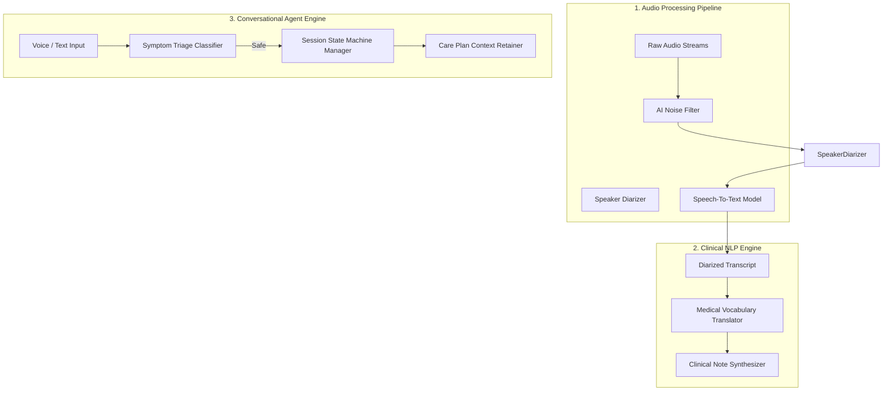
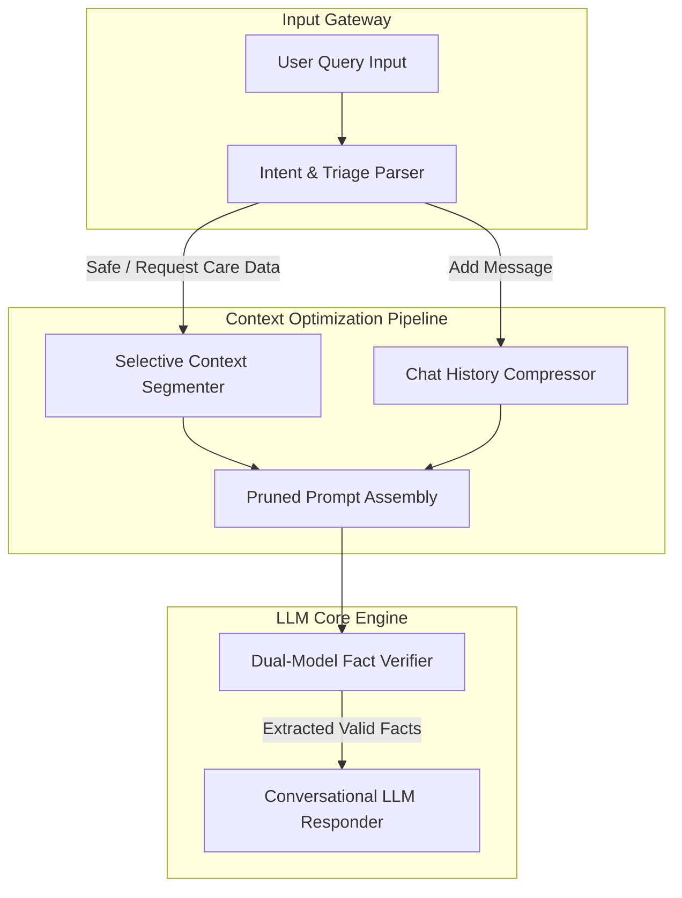

# AI Pipeline & Agent Architecture
## Project Name: Medical AI Platform (Doctor Booking + AI Clinical Scribe & Companion)

This document describes the design of the artificial intelligence processing pipelines, including speech-to-text transcription, clinical note structuring, and prompt-context optimizations.

---

## 1. AI System Pipeline Diagram

The artificial intelligence processes are divided into three components: raw signal processing, clinical note structuring, and dialog prompt controllers.

---

## 2. Component Pipeline Explanations

### 2.1. Audio Processing Pipeline
* **AI Noise Filter**: Suppresses background clinical environment noises (e.g., keyboard clatter, air conditioners, background speech).
* **Speaker Diarizer**: Separates the conversation audio into distinct channels or speaker tracks, labeling who spoke when (e.g., "Doctor" vs. "Patient").
* **Speech-to-Text Model**: Converts the diarized audio tracks into a timestamped transcript.

### 2.2. Clinical Natural Language Processing (NLP) Engine
* **Medical Vocabulary Translator**: Maps general descriptions of symptoms (e.g., "rapid heartbeat") to standard clinical terminology (e.g., "tachycardia") to assist the doctor.
* **Clinical Note Synthesizer**: Parses transcripts to extract details and drafts a clinical note following the four-part Subjective, Objective, Assessment, and Plan (SOAP) schema.

### 2.3. Conversational Agent Engine
* **Symptom Triage Classifier**: An entry filter that scans patient messages for red-flag terms indicating potential medical emergencies, triggering immediate routing to emergency resources.
* **Session State Machine Manager**: Enforces structural constraints during scheduling (e.g., preventing the user from booking a slot before completing identity and triage checks).

---

## 3. Care Companion Context Window Optimization Architecture

To prevent Large Language Model (LLM) hallucinations and context dilution during long chat sessions, the Conversational Agent Microservice uses a multi-tier Context Optimization Pipeline:

### Optimization Components:
1. **Selective Context Segmenter (Topic-Based Partitioning)**:
   * The doctor-approved care plan is split into distinct logical segments (e.g., Medications, Precautions, Follow-up instructions).
   * Instead of passing the entire care plan with every message, the segmenter matches the user's question to relevant topics and injects *only* the matching plan segments into the prompt.
2. **Chat History Compressor (Sliding Summary Window)**:
   * The system maintains a sliding window of the last 3-4 dialogue turns.
   * Older conversation history is processed by a lightweight summarization routine, which condenses the dialogue context into a concise bulleted history. This summary is injected at the top of the prompt window, preventing context length explosion.
3. **Dual-Model Fact Verifier**:
   * A small, high-speed security model reads the question and the care plan segment, extracting a structured data payload (e.g., `{"medication": "Amoxicillin", "dose_frequency": "twice daily"}`).
   * The Conversational LLM Responder is fed *only* this validated fact sheet to construct its warm response, completely cutting off the responder's ability to hallucinate details not present in the doctor-approved file.
