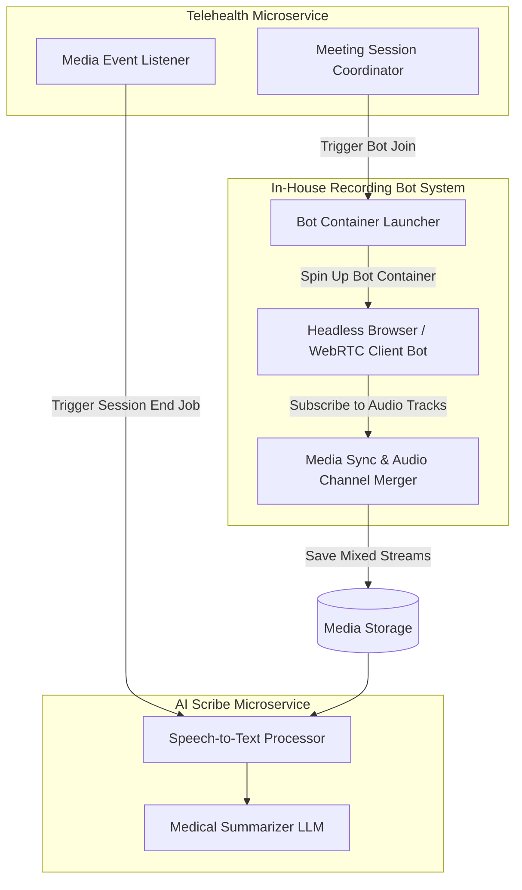

# Backend & Bot System Architecture
## Project Name: Medical AI Platform (Doctor Booking + AI Clinical Scribe & Companion)

This document outlines the design of the decoupled backend services and our custom, in-house virtual consultation recording bot framework.

---

## 1. Backend Services Architecture Diagram

The backend services run as isolated microservice deployments that communicate asynchronously via an Event Broker (Message Queue / Event Bus) for non-blocking task coordination.

---

## 2. Microservice Descriptions

* **Scheduling & Booking Microservice**: Manages public search, user profiles, availability slots, and calendar reservation tables.
* **Telehealth & Media Microservice**: Controls call session setups, dynamic room routing, call lifecycle state, and in-house recording bots.
* **AI Clinical Scribe Microservice**: Consumes post-session media payloads, executing audio filtering, diarization, transcription, and note structuring.
* **Conversational Agent Microservice**: Houses the conversational engines for both the Booking Agent and the Care Companion.

---

## 3. In-House WebRTC Bot Recording Framework

Rather than using third-party transcription recording bots, the platform runs a proprietary headless WebRTC recording system.

### Detailed Lifecycle & Step-by-Step Flow:
1. **Trigger Phase**:
   * A virtual consultation is initialized by a patient and doctor joining a WebRTC meeting room.
   * The Telehealth Microservice captures this activation and fires a command payload to the Bot Container Launcher.
2. **Launch & Join Phase**:
   * The launcher initializes a lightweight, containerized browser script instance.
   * This headless participant joins the active meeting room as a silent participant (it does not publish any local video or audio streams to the room, preventing layout disruptions).
3. **Capture Phase**:
   * The headless bot subscribes directly to the incoming WebRTC audio and video tracks of the doctor and patient.
   * It extracts raw audio tracks and pipes them to the local container buffer.
4. **Merge & Synchronization**:
   * A Media Sync and Audio Channel Merger process lines up the separate streams based on absolute call time markers, correcting issues caused by network jitter or temporary call drops.
5. **Storage Hand-off**:
   * The synchronized, mixed (or dual-channel) audio file is written directly to the secure Media Storage Service.
   * Upon successful transfer, the container terminates, freeing host system memory.
6. **Processing Trigger**:
   * The Telehealth Microservice detects session termination, sending a message to the Event Broker to begin transcription in the Scribe microservice.
