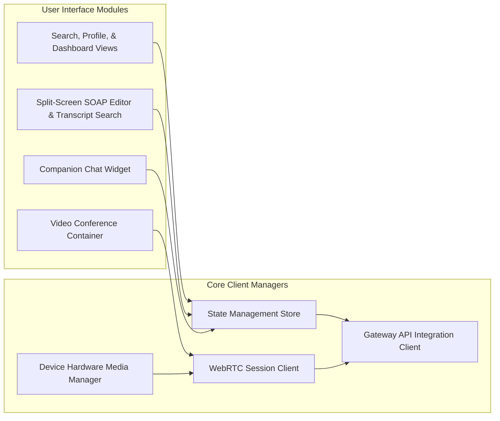

# Frontend Architecture
## Project Name: Medical AI Platform (Doctor Booking + AI Clinical Scribe & Companion)

This document describes the structure and module dependencies of the frontend applications (Patient Portal and Doctor Dashboard Portal).

---

## 1. Frontend Component Diagram

The client-side architecture divides layout modules from background hardware controller interfaces. State stores update UI components while receiving telemetry directly from peripheral capture drivers.

---

## 2. Component Explanations

### 2.1. User Interface Modules
* **Portal Views**: Handles doctor search listings, scheduling workflows, profile renders, and public credentials.
* **Clinical Scribe Workspace**: A custom split-screen workspace interface for doctors. The left-hand panel provides search filters for the consultation transcript, and the right-hand panel renders the editable clinical note.
* **Care Companion Chat Interface**: A client-side overlay window enabling patients to interact with their recovery agent post-visit.
* **Video Conference Container**: Renders call video, participant layouts, and triggers state toggles for mic/camera controls.

### 2.2. Core Client Managers
* **State Management Store**: Coordinates the data layer, caching scheduling query inputs, chat logs, user profile information, and pending consultation edits.
* **Device Hardware Media Manager**: Requests microphone and camera access permissions. For in-person consultations, it splits audio streams, monitors device input volume, and handles chunked uploading.
* **WebRTC Session Client**: Interfaces with the media router to establish audio and video connections, and reports network performance metrics (e.g., packet loss, call latency).
* **Gateway API Client**: Coordinates all HTTP and WebSocket connections to the API Gateway.
