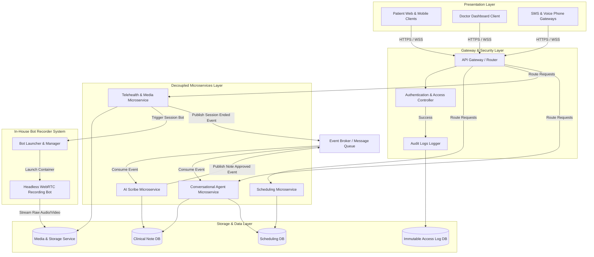

# High-Level System Architecture
## Project Name: Medical AI Platform (Doctor Booking + AI Clinical Scribe & Companion)

This document describes the high-level system-wide design and data flow of the Medical AI Platform. For specific module details and tradeoffs, refer to the sub-documents in this directory.

### Sub-Architecture Directory:
* [Frontend Architecture](file:///Users/ramandeepsingh/Developer/Personal%20Projects/Medical%20AI/docs/architecture/frontend.md)
* [Backend & Bot System Architecture](file:///Users/ramandeepsingh/Developer/Personal%20Projects/Medical%20AI/docs/architecture/backend.md)
* [AI Scribe & Agent Pipeline Architecture](file:///Users/ramandeepsingh/Developer/Personal%20Projects/Medical%20AI/docs/architecture/ai.md)
* [Architectural Tradeoff Decisions](file:///Users/ramandeepsingh/Developer/Personal%20Projects/Medical%20AI/docs/architecture/tradeoffs.md)

---

## 1. High-Level System Diagram

The platform utilizes a decoupled, event-driven **Microservices Architecture**. Distinct business segments run as isolated services that manage their own databases and communicate asynchronously via a central Event Broker.

---

## 2. Overall System Flow Description

1. **Access Control & Routing**: All client calls hit the central API Gateway. It validates access tokens, records audit entries, and routes requests to the corresponding microservice.
2. **Scheduling & Booking**: The Scheduling Microservice operates independently, managing availability slots and booking records in its own database.
3. **Telehealth Consultation & Recording**: 
   * When a virtual meet begins, the Telehealth Microservice triggers the in-house Bot Launcher.
   * A containerized Headless Recording Bot joins the room, captures raw synchronized audio/video, and streams it directly to the Media Storage Service.
   * Once the session terminates, the Telehealth Service emits a `Session Ended` event onto the Event Broker.
4. **AI Note Processing**: The AI Scribe Microservice consumes the `Session Ended` event, retrieves the audio from storage, transcribes and structures the clinical note, and saves the draft.
5. **Care Companion Activation**: When the doctor signs off on the note, a `Note Approved` event is published, signaling the Conversational Agent Microservice to initialize Care Companion follow-up schedules.
