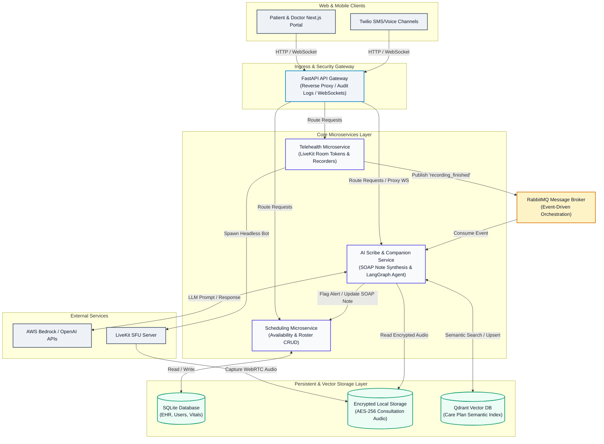

# High-Level System Architecture
## Project Name: Medical AI Platform (Doctor Booking + AI Clinical Scribe & Companion)

This document describes the high-level system-wide design and data flow of the Medical AI Platform. For specific module details and tradeoffs, refer to the sub-documents in this directory.

### Sub-Architecture Directory:
* [Frontend Architecture](file:///Users/ramandeepsingh/Developer/Personal%20Projects/Medical%20AI/docs/architecture/frontend.md)
* [Backend & Bot System Architecture](file:///Users/ramandeepsingh/Developer/Personal%20Projects/Medical%20AI/docs/architecture/backend.md)
* [AI Scribe & Agent Pipeline Architecture](file:///Users/ramandeepsingh/Developer/Personal%20Projects/Medical%20AI/docs/architecture/ai.md)
* [Architectural Tradeoff Decisions](file:///Users/ramandeepsingh/Developer/Personal%20Projects/Medical%20AI/docs/architecture/tradeoffs.md)

---

## 1. High-Level System Diagram

The platform utilizes a decoupled, event-driven **Microservices Architecture**. The core business logic is split across distinct services that communicate asynchronously via a central Message Broker and route traffic through an API Gateway:

---

## 2. Overall System Flow Description

1. **Access Control & Routing**: All client traffic hits the central FastAPI Gateway, which gates protected routes with JWT authorization checks, creates structured JSON audit logs, and handles WebSocket proxying.
2. **Scheduling & Booking**: The Scheduling Microservice manages the SQLite database (`medical_ai_local.db`), verifying available doctor calendar slots, booking appointments with concurrency conflict blocks, and handling patient vital health profiles.
3. **Telehealth Consultation & Audio Capture**: 
   * When a virtual meet begins, the Telehealth Microservice triggers a Playwright recording bot.
   * The containerized bot joins the WebRTC session, records the consultation audio, encrypts it using AES-256 Fernet cryptography, and saves it locally.
   * The Telehealth Service then publishes a `recording_finished` event to RabbitMQ.
4. **AI Scribe Note Generation**: The Scribe Service consumes the event from RabbitMQ, decrypts the audio file, routes the transcript to AWS Bedrock (Claude 3.5 Sonnet) for SOAP note structuring, and saves the draft.
5. **Care Companion Activation & Guardrails**: Once the doctor approves the note, the Care Companion LangGraph workflow is initialized. Patient-friendly summaries are indexed in a Qdrant Vector database, enabling semantic RAG checks with symptom triage safety gates.
