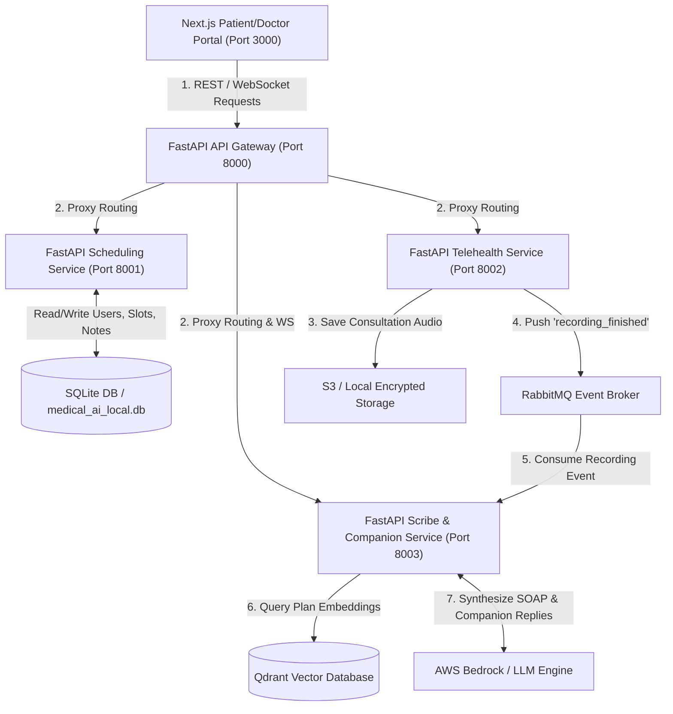
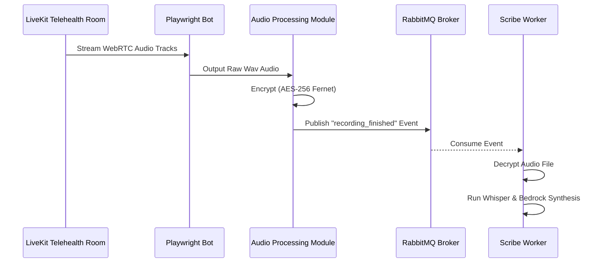
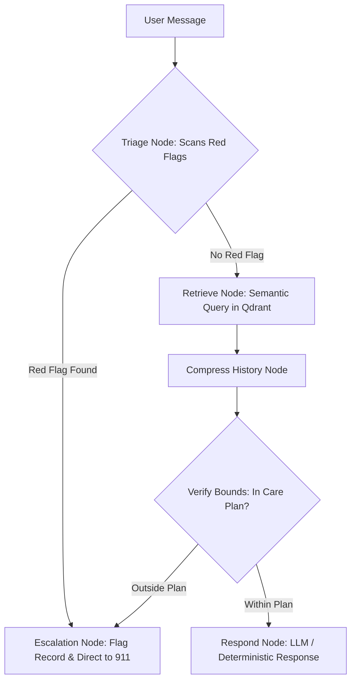

# Software Engineering Learnings: Medical AI Platform

Welcome! As a software engineer transitioning from **"vibe coding"** (rapid prototyping with AI assistance) to **production-grade systems engineering**, this document is your guide to understanding the architectural design patterns, trade-offs, and critical software principles implemented in this platform.

Building a functional prototype is only 20% of the battle. The remaining 80% is ensuring the system is **scalable, secure, concurrent, testable, and regulatory-compliant**.

---

## 1. High-Level Application Architecture

The platform operates as a set of distributed microservices communicating via REST APIs, WebSockets, and asynchronous Message Queues:



---

## 2. Top 5 Architectural & Engineering Patterns

---

### Pattern 1: Centralized API Gateway, JWT Auth Routing, & Structured Audit Logs

#### Core Concept
In a microservices architecture, exposing every service directly to the internet is a security hazard. The **API Gateway** pattern creates a single entry point that manages:
1. **Request Proxying**: Translating public routes directly to internal microservice ports.
2. **Centralized Authentication**: Authenticating requests once, extracting the payload (e.g., User ID, Role), and passing these variables downstream as header parameters (e.g., `X-User-Id`), avoiding duplicated token check logic in every service.
3. **Structured Auditing**: Generating uniform JSON log structures for every request to simplify observability, trace latency issues, and fulfill regulatory requirements.

#### Tech Stack
* **FastAPI** (`AsyncClient` for high-throughput non-blocking HTTP proxying).
* **PyJWT** (for token signature signing and verification).
* **Uvicorn** (Asynchronous Server Gateway Interface running Python code).

#### Reference Implementation
* Gateway Router & WebSockets: [gateway/app/main.py](file:///Users/ramandeepsingh/Developer/Personal%20Projects/Medical%20AI/gateway/app/main.py)
* Token Verification & Claims Extraction: [gateway/app/middleware/auth.py](file:///Users/ramandeepsingh/Developer/Personal%20Projects/Medical%20AI/gateway/app/middleware/auth.py)
* Auditing Log Outputs: [gateway/app/middleware/audit.py](file:///Users/ramandeepsingh/Developer/Personal%20Projects/Medical%20AI/gateway/app/middleware/audit.py)

#### Alternatives & Trade-offs
| Pattern Option | Pros | Cons |
| :--- | :--- | :--- |
| **Custom Python Gateway (Implemented)** | • Dynamic, programmatic customization (e.g., custom WebSocket proxying).<br>• Zero external dependency overhead. | • Harder to optimize compared to C/Go engines.<br>• Developers must write routing logic manually. |
| **Nginx / Kong / Traefik** | • Built-in high performance and load balancing.<br>• Native plugin architectures for rate-limiting. | • Requires learning configuration templates (Declarative configuration).<br>• Harder to program complex request-payload mutations dynamically. |
| **AWS API Gateway** | • Fully managed, serverless scaling.<br>• Integrated DDoS protection. | • High cost at large request scales.<br>• Restricts local development and testing. |

---

### Pattern 2: Database Concurrency Control & Scheduling Rules

#### Core Concept
Scheduling systems are prone to **race conditions** (e.g., two patients booking the same slot at the exact same millisecond). Standard application-level checks like `if slot_is_free(): book_slot()` are vulnerable to timing gaps between lookup and commit. 

This platform implements **database-level validation** using a **Partial Unique Index constraint**. This guarantees that the constraint is enforced by the database engine atomically, preventing double-bookings even if requests arrive simultaneously.

#### Tech Stack
* **SQLAlchemy ORM** (Object Relational Mapper defining constraints).
* **Alembic** (Database schema migration manager).
* **SQLite / PostgreSQL** (Engines parsing constraint instructions).

#### Reference Implementation
* Partial Index Constraint: [services/scheduling/app/models.py#L145-L154](file:///Users/ramandeepsingh/Developer/Personal%20Projects/Medical%20AI/services/scheduling/app/models.py#L145-L154)
* Conflict Exception Responding: [services/scheduling/app/main.py](file:///Users/ramandeepsingh/Developer/Personal%20Projects/Medical%20AI/services/scheduling/app/main.py)

#### Alternatives & Trade-offs
| Pattern Option | Pros | Cons |
| :--- | :--- | :--- |
| **Partial Unique Database Index (Implemented)** | • Handled natively by the database engine.<br>• Maximum performance, zero network delay. | • Tightly couples application behavior to SQL dialect syntax.<br>• Can fail if database engines do not support partial constraints. |
| **Distributed Locks (Redis/Redlock)** | • Works across multiple disparate databases.<br>• Highly custom locking rules can be defined. | • Heavy dependency on an external cache layer.<br>• Lock leaks can block slots permanently on server crashes. |
| **Optimistic Locking (Version Fields)** | • Database-agnostic solution.<br>• Avoids blocking database threads. | • Requires writing retry loops in the application layer.<br>• Degrades under high concurrency write volumes. |

---

### Pattern 3: Headless WebRTC Media Capturing, Encryption, and Async Pipelines

#### Core Concept
Telehealth clinical capturing involves recording a live WebRTC audio stream. To do this, the system spawns a **headless browser bot** that joins the conference room as an active participant to record the session. 

Once finished:
1. The recording is encrypted immediately using **Fernet symmetric cryptography** (protecting Patient Health Information at rest).
2. An asynchronous **event payload** is dispatched to RabbitMQ.
3. A background **consumer worker** picks up the task, decrypts the file, and runs transcription/synthesis without blocking the API Gateway thread.



#### Tech Stack
* **Playwright** (Headless browser automation).
* **Cryptography (Fernet)** (Symmetric AES-256 encryption library).
* **RabbitMQ & Pika** (Broker service and Python queue subscriber).

#### Reference Implementation
* Playwright Recording Participant: [services/telehealth/recorder/bot.py](file:///Users/ramandeepsingh/Developer/Personal%20Projects/Medical%20AI/services/telehealth/recorder/bot.py)
* Audio Mixer & Cryptography: [services/telehealth/app/process_audio.py](file:///Users/ramandeepsingh/Developer/Personal%20Projects/Medical%20AI/services/telehealth/app/process_audio.py)
* AMQP Event Broker Listener: [services/scribe/app/consumer.py](file:///Users/ramandeepsingh/Developer/Personal%20Projects/Medical%20AI/services/scribe/app/consumer.py)

#### Alternatives & Trade-offs
| Pattern Option | Pros | Cons |
| :--- | :--- | :--- |
| **Headless Playwright Bot (Implemented)** | • Simplifies client integration (works on generic WebRTC rooms).<br>• Fully customize browser recording scripts. | • High memory and CPU cost (spawning browser environments).<br>• Latency from starting cold browser contexts. |
| **Native Media Server Recording (LiveKit Egress)** | • Mixed audio recording built directly into server pipelines.<br>• Extremely low resource cost. | • High system setup and configuration complexity.<br>• Tightly couples code to LiveKit API limits. |
| **Client-Side Browser Recording** | • Zero server execution or storage cost.<br>• Browser handles recording internally. | • High risk of data loss (e.g., patient closes window prematurely).<br>• Slows user experience due to upload bandwidth requirements. |

---

### Pattern 4: Stateful Multi-Agent AI Workflows (LangGraph) & Vector Retrieval (Qdrant)

#### Core Concept
Generative AI in healthcare requires strict **safety guardrails**. A standard LLM conversation loop is highly prone to hallucinating diagnoses or prescribing unauthorized medications. 

To prevent this:
1. The Care Companion uses **LangGraph** to model the conversation as a state machine.
2. The user's query is scanned by a **Triage Node** for red-flag symptoms.
3. If triage passes, the query is mapped to a **Retrieval Node** that pulls relevant patient data from the **Qdrant Vector Database**.
4. The **Response Node** uses this context to construct a warm, data-anchored response. If the query lies outside the clinical notes, the agent triggers an **Escalation Protocol** to alert the clinic.



#### Tech Stack
* **LangGraph** (StateGraph orchestration library).
* **Qdrant Vector Database** (Local database for semantic indexing).
* **Amazon Bedrock (Claude 3.5 Sonnet)** (The core LLM engine).

#### Reference Implementation
* LangGraph State Machine, Embeddings, & Guardrails: [services/scribe/app/companion.py](file:///Users/ramandeepsingh/Developer/Personal%20Projects/Medical%20AI/services/scribe/app/companion.py)

#### Alternatives & Trade-offs
| Pattern Option | Pros | Cons |
| :--- | :--- | :--- |
| **LangGraph State Graph (Implemented)** | • High control over logical state paths.<br>• Explicit triage checkpoints run before LLM calls. | • Multi-node routing adds execution latency.<br>• Higher cognitive complexity than basic chains. |
| **Standard LangChain RAG Chain** | • Easy to write and test.<br>• Low development overhead. | • Hard to guarantee strict node logic routing.<br>• Prone to prompt injection and out-of-scope answers. |
| **OpenAI Assistants API** | • Fully managed, zero infrastructure overhead.<br>• Thread history handled automatically. | • Exposes patient data to third parties.<br>• Limited control over internal state transitions. |

---

### Pattern 5: Client-Side Routing Gates & Theme Transitions (CSS Variables + Zustand)

#### Core Concept
Modern web platforms require clean layout flows, fast state storage, and dynamic styling support:
1. **Route Security**: If a guest tries to access protected patient dashboard routes, the system blocks them immediately. Gating runs client-side inside React contexts before rendering pages.
2. **State Management**: A client-side store manages global variables (like user info and tokens) and synchronizes them with LocalStorage automatically.
3. **Adaptive Themes**: A universal provider maps custom CSS variables to the document root, enabling instant transitions between Light and Dark mode without page refreshes.

#### Tech Stack
* **Next.js App Router & React Context**.
* **Zustand** (Minimalist state store).
* **Tailwind CSS & CSS Custom Variables**.

#### Reference Implementation
* Gated Router Guard: [patient-portal/src/components/AuthGatingProvider.tsx](file:///Users/ramandeepsingh/Developer/Personal%20Projects/Medical%20AI/patient-portal/src/components/AuthGatingProvider.tsx)
* Client-Side Zustand Authentication Store: [patient-portal/src/store/useAuthStore.ts](file:///Users/ramandeepsingh/Developer/Personal%20Projects/Medical%20AI/patient-portal/src/store/useAuthStore.ts)
* Universal Custom Styles & Theme Provider: [patient-portal/src/components/ThemeProvider.tsx](file:///Users/ramandeepsingh/Developer/Personal%20Projects/Medical%20AI/patient-portal/src/components/ThemeProvider.tsx)

#### Alternatives & Trade-offs
| Pattern Option | Pros | Cons |
| :--- | :--- | :--- |
| **Client-Side Gating & Zustand (Implemented)** | • Highly performant client state transitions.<br>• Decouples auth logic from backend framework limits. | • Layouts may experience brief flashes before gating redirects.<br>• Relies on client-side JS being enabled. |
| **Next.js Middleware Gating** | • Blocks unauthorized requests on the server before rendering starts.<br>• Highly secure. | • Complex configuration when handling dynamic microservice JWTs.<br>• Can block static export features. |
| **NextAuth.js / Auth0** | • Industry-standard login providers.<br>• Supports OAuth out of the box. | • High configuration boilerplate.<br>• Overkill for lightweight custom gateway setups. |

---

## 3. Production Engineering: Prototype to Production

Moving from a prototype to a production environment requires shifting focus from **velocity** to **robustness**:

### I. Database Migrations
* **Why**: Vibe coding often relies on `Base.metadata.create_all()` which recreates database structures on start. This deletes production database tables.
* **Production Practice**: Use **Alembic** to manage database schemas. Each change generates a migration file, allowing safely applied updates to running systems:
  ```bash
  # Generate a migration script
  alembic revision --autogenerate -m "add_password_hash"
  # Apply migrations to database safely
  alembic upgrade head
  ```

### II. Configuration Boundaries
* **Why**: Storing database paths, AWS secret keys, or API tokens directly inside script logic exposes keys in Git code commits.
* **Production Practice**: Use Pydantic Settings classes to read variables from the environment and fail early on missing configurations.
* **Reference**: [services/scheduling/app/config.py](file:///Users/ramandeepsingh/Developer/Personal%20Projects/Medical%20AI/services/scheduling/app/config.py)

### III. System Testing & QA Pipelines
* **Why**: Manual UI clicks are slow, unreliable, and cannot catch subtle backend bugs.
* **Production Practice**: Code automated E2E pipelines ([verify_all_e2e.py](file:///Users/ramandeepsingh/Developer/Personal%20Projects/Medical%20AI/verify_all_e2e.py)) that simulate complete user flows programmatically, verifying status codes, conflict handling, and payload variables.

---

## 4. HIPAA & Healthcare Compliance Checklist

If this platform were to handle actual clinical data in the United States, it would be regulated under the **Health Insurance Portability and Accountability Act (HIPAA)**. 

Below is how this system aligns with HIPAA's security rules:

| Security Rule Section | How Implemented in this Platform | Required Next Steps for Production |
| :--- | :--- | :--- |
| **Transmission Security (Encryption)** | • AES-256 encryption on captured consultation audio files using Fernet cryptography keys ([process_audio.py](file:///Users/ramandeepsingh/Developer/Personal%20Projects/Medical%20AI/services/telehealth/app/process_audio.py)). | • Enforce HTTPS (TLS 1.3) traffic everywhere (internal microservice networks and public endpoints). |
| **Audit Controls (Observability)** | • Structured API Gateway JSON log entries capture who made requests, IP addresses, which records were viewed, and timestamps ([audit.py](file:///Users/ramandeepsingh/Developer/Personal%20Projects/Medical%20AI/gateway/app/middleware/audit.py)). | • Stream audit logs to a secure, write-once, read-many (WORM) storage service (e.g., AWS CloudWatch with log locks). |
| **Access Control (Gating)** | • Gateways validate user role claims, blocking patients from viewing clinician SOAP notes and preventing room hijacking ([auth.py](file:///Users/ramandeepsingh/Developer/Personal%20Projects/Medical%20AI/gateway/app/middleware/auth.py)). | • Implement Multi-Factor Authentication (MFA) for clinician logins.<br>• Add automatic session lockouts. |
| **Vendor Management (BAAs)** | • AI LLM prompts and vector entries are indexed using deterministic embeddings to avoid sending raw text to third-party APIs. | • Sign **Business Associate Agreements (BAAs)** with AWS (for Bedrock and S3 storage) and LiveKit (if using managed services). |
