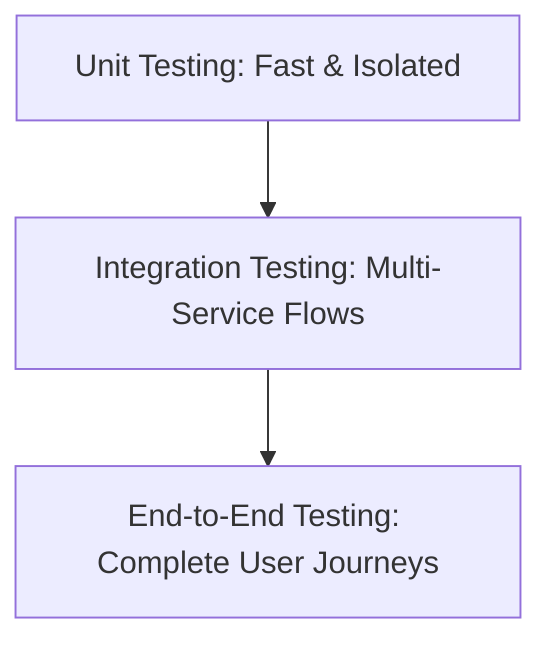

# Platform Testing Strategy - Quality Assurance Blueprint

This document details the strategy for testing the end-to-end Medical AI platform. Our goal is to verify that all workflows operate seamlessly and that the codebase is completely free of bugs.

---

## Testing Hierarchy & Strategy

We will execute testing in a structured, bottom-up sequence:

### Phase 1: Isolated Unit Testing
* **Objective**: Validate the logic of individual modules, helper functions, and database schemas in isolation without spawning downstream networks.
* **Scope**:
  * Triage symptom scanners (`check_emergency_symptoms`).
  * LiveKit token generation encoders.
  * Next.js Zustand authentication state store.
* **Tools**: Python `unittest`/`pytest` for services, `jest` or React testing libraries for Next.js frontend state.

### Phase 2: Multi-Service Integration Testing
* **Objective**: Ensure that API Gateway routes request traffic, updates databases, and executes microservice handshakes correctly.
* **Scope**:
  * Gateway proxy paths mapping to telehealth, scheduling, and scribe.
  * SQL migrations and database CRUD constraints.
  * Real endpoints validations (e.g. `POST /api/v1/public/auth/login`, `GET /api/v1/public/doctors`).
* **Tools**: Python `httpx` integration scripts, postman/curl collections, and test runners.

### Phase 3: System-Wide End-to-End (E2E) Testing
* **Objective**: Replicate full user personas (Patient and Physician) navigating the platform from start to finish.
* **Key E2E User Journeys**:
  1. **Patient Booking Journey**: Registering a patient, searching for Dr. Alice Heart (Cardiologist), choosing a calendar slot, booking, and confirming checkout statuses.
  2. **Telehealth Consultation & Scribe Loop**: Starting a telehealth room meeting, streaming audio transcription, feeding transcript to the LLM agent, drafting SOAP notes in the split-screen editor, auto-saving, and signing off.
  3. **AI Companion & Triage Escalation**: Toggling the floating microphone drawer, requesting medical summaries, asking off-topic trivia (verifying blockers), and speaking warning symptoms (verifying triage emergency hang-up).
  4. **Universal Light/Dark mode transitions**: Toggling modes across the welcome panel, dashboard queues, and scribe workspace.
* **Tools**: Playwright / Cypress for automated browser steps, manual validation scripts (e.g. `verify_phase9.py`).
